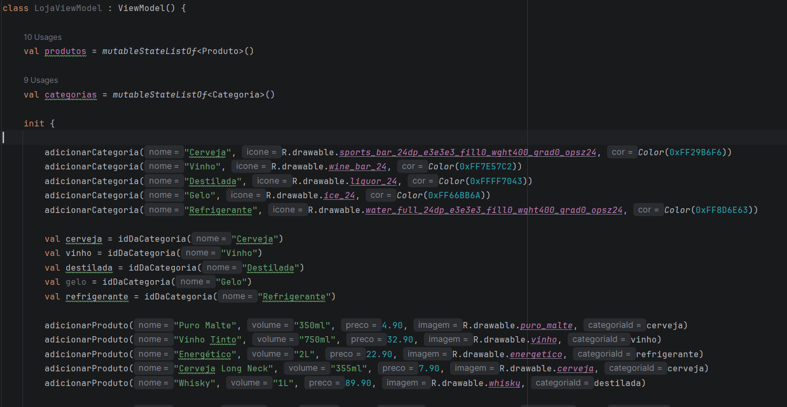
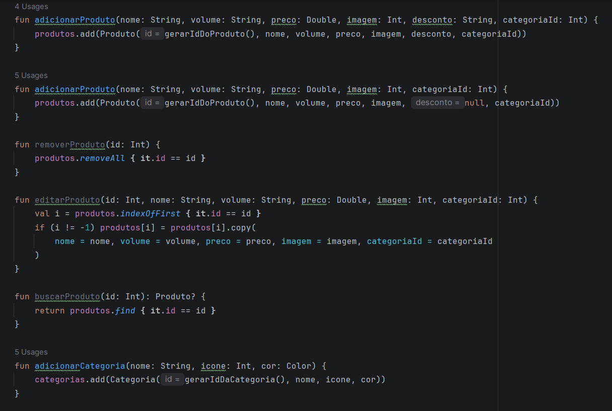
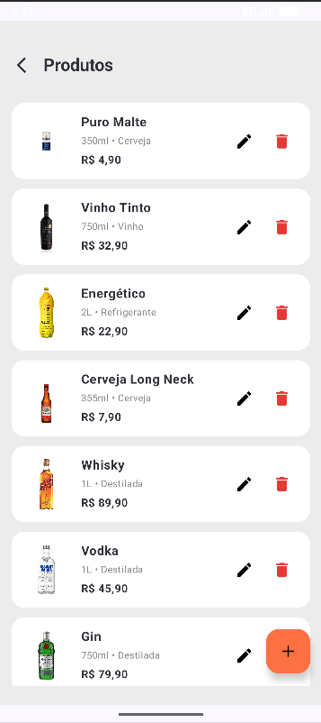
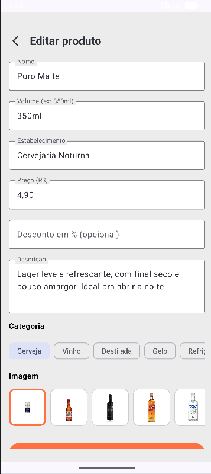
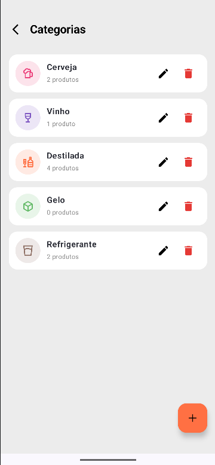
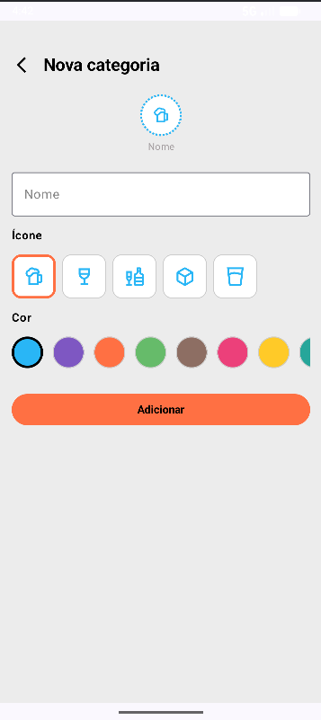

# Documentação do Processo de Desenvolvimento

Durante a primeira parte do trabalho foram desenvolvidas 3 telas que não implementavam navegação entre elas, sendo elas a tela de início, detalhes do produto e rastreio. Para cumprir com os requisitos da segunda parte do trabalho, foram criados os arquivos de navegação e rotas, adicionando as seguintes telas:

 * Tela de Pagamento;
 * Tela do Carrinho;
 * Tela da Entrega;
 * Tela de Produtos por Categoria;

   

A tela de perfil não estava no esboço original da aplicação e por isso fica comentado por enquanto, no futuro pode ser adicionado como uma tela independente. Além disso, os arquivos das telas no diretório 'screens' foram criados, porém apenas a tela de pagamento teve seu desenvolvimento iniciado e não está completa.

# Tela Inicial

A primeira modificação em relação a primeira parte do trabalho será transformar as listas de produtos e categorias (que são estáticas) em listas mutáveis, para no futuro criar o CRUD dessas classes. Modificamos as classes de produtos e categorias para terem id e categoriaId, e adicionamos o viewModel com init dos dados que já existiam anteriormente, junto dos métodos do CRUD.

Em seguida mudamos o appNavigation para criar o navController e ViewModel que serão passados para as telas como parâmetros. Agora as funções que antes utilizavam as listas estáticas criadas no próprio arquivo da tela inicial apenas chamam as funções do ViewModel. Visualmente a tela continua igual, porém com um fluxo diferente do anterior, e também o aplicativo abre automaticamente na tela inicial.

Em seguida criamos a navegação dos cards dos produtos, agora quando clicamos em card somos direcionados a tela de detalhes do produto com informações específicas dele. Abaixo segue o vídeo demonstrando essa parte:

Para cumprir com os requisitos do trabalho foi necessário criar duas telas que mostram os produtos e categorias utilizando LazyColumns e que permitem a alteração dos objetos com os métodos do CRUD em ViewModel. Nessas telas podemos adicionar, editar e excluir os elementos das listas, para isso existe uma segunda tela de formulário, que já vem completa com as informações se a escolha for editar um item que já existe ou então em branco para adicionar novo item.

