# Documentação do Processo de Desenvolvimento

Durante a primeira parte do trabalho foram desenvolvidas 3 telas que não implementavam navegação entre elas, sendo elas a tela de início, detalhes do produto e rastreio. Para cumprir com os requisitos da segunda parte do trabalho, foram criados os arquivos de navegação e rotas, adicionando as seguintes telas:

 * Tela de Pagamento;
 * Tela do Carrinho;
 * Tela de Produtos por Categoria;

Além disso foram criadas telas para mostrar os produtos e categorias em colunas que levam aos formulários, isso foi feito para cumprir com os requisitos descritos no trabalho. Dessa forma fechamos o fluxo principal do aplicativo que vai desde a tela inicial até a tela de rastreio com o pedido, junto das telas que permitem a manipulação das listas.

* Tela produtos
* Tela categorias
* Tela formulario produtos
* Tela formulario categorias

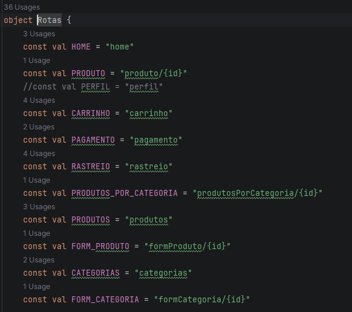

A tela de perfil não estava no esboço original da aplicação e por isso fica comentado por enquanto, no futuro pode ser adicionado como uma tela independente. Além disso, os arquivos das telas no diretório 'screens' foram criados, porém apenas a tela de pagamento teve seu desenvolvimento iniciado e não está completa.

# Tela Inicial

A primeira modificação em relação a primeira parte do trabalho será transformar as listas de produtos e categorias (que são estáticas) em listas mutáveis, para no futuro criar o CRUD dessas classes. Modificamos as classes de produtos e categorias para terem id e categoriaId, e adicionamos o viewModel com init dos dados que já existiam anteriormente, junto dos métodos do CRUD.

Em seguida mudamos o appNavigation para criar o navController e ViewModel que serão passados para as telas como parâmetros. Agora as funções que antes utilizavam as listas estáticas criadas no próprio arquivo da tela inicial apenas chamam as funções do ViewModel. Visualmente a tela continua igual, porém com um fluxo diferente do anterior, e também o aplicativo abre automaticamente na tela inicial.

Em seguida criamos a navegação dos cards dos produtos, agora quando clicamos em card somos direcionados a tela de detalhes do produto com informações específicas dele. Abaixo segue o vídeo demonstrando essa parte:

Para cumprir com os requisitos do trabalho foi necessário criar duas telas que mostram os produtos e categorias utilizando LazyColumns e que permitem a alteração dos objetos com os métodos do CRUD em ViewModel. Nessas telas podemos adicionar, editar e excluir os elementos das listas, para isso existe uma segunda tela de formulário, que já vem completa com as informações se a escolha for editar um item que já existe ou então em branco para adicionar novo item.

Na tela inicial, o botão Gerenciar (ao lado de "Categorias") leva para a lista de categorias, e a barra inferior leva para a lista de produtos. Assim, as duas listas do CRUD ficam acessíveis a partir da navegação principal e não apenas por rotas escondidas.

# Uso do TopAppBar

Na primeira parte do trabalho o cabeçalho para voltar a tela era apenas um icone que não funciona, nessa segunda parte decidimos criar um componente reutilizável para todas as telas que vão ter um cabeçalho com botão de voltar.

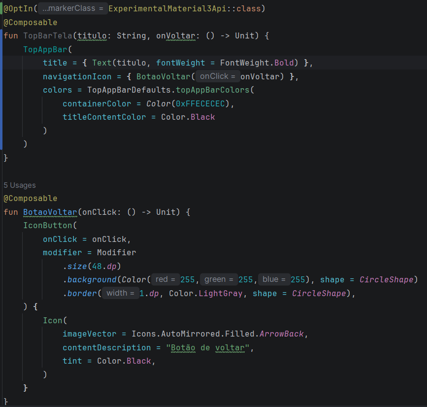

O componente TopBarTela fica nos components da UI e é usado nas listas, nos formulários, no carrinho, no pagamento, no rastreio e em produtos por categoria. O botão de voltar chama navController.poBackStack(), que é passado para a tela como função onVoltar.

# Formularios

As telas dos formulários estavam concentrando muitas responsabilidades, então decidimos manter a parte da lógica de validação no viewModel e na tela apenas a IU.

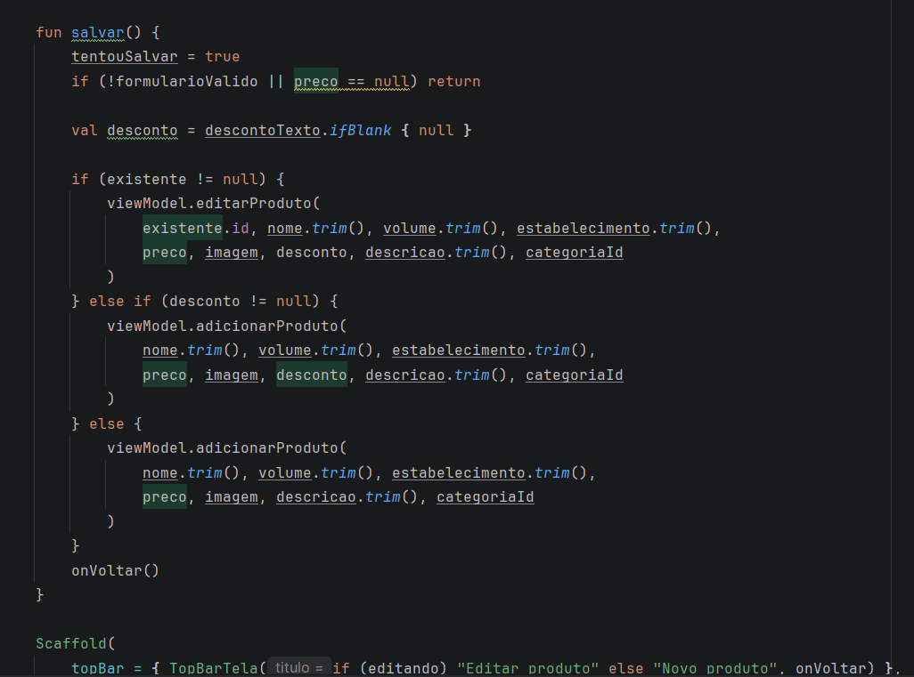

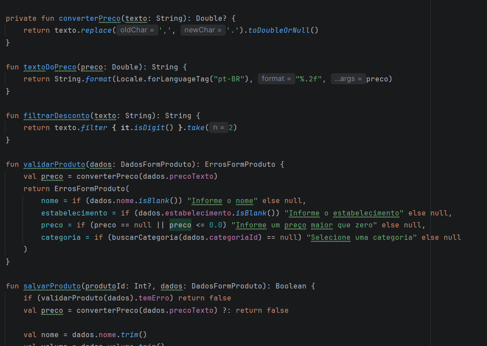

Algumas questões dessa decisão:

* Um formulário só para criar e editar. A rota recebe um id: com -1 o formulário abre em branco (novo item), com qualquer outro valor ele busca o item no ViewModel e já vem preenchido. Isso evitou duplicar as telas.
* Erros agrupados em uma data class. O ViewModel devolve um ErrosFormProduto (nome, estabelecimento, preço e categoria) com uma propriedade temErro. A tela só decide como mostrar a mensagem, e o ViewModel decide se pode salvar.
* Erro só depois de tentar salvar. A variável tentouSalvar impede que o formulário apareça todo vermelho assim que é aberto.
* Campos adequados a cada dado. O preço usa teclado decimal e aceita vírgula (4,90 é convertido para 4.90); o desconto usa teclado numérico e o ViewModel filtra para aceitar só 2 dígitos; a categoria é escolhida por chips e a imagem entre as opções disponíveis.
* Estado do formulário com rememberSaveable, para o que foi digitado não se perder ao girar a tela.

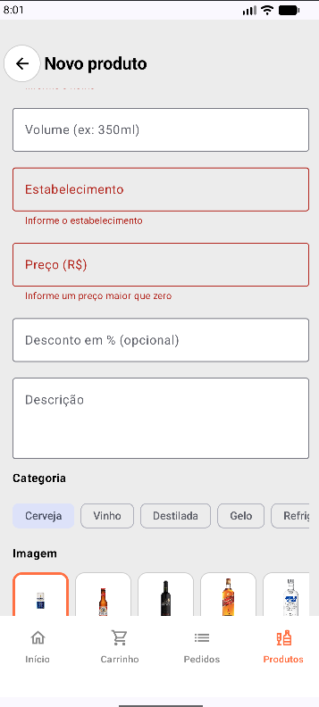

# Navegação: Rotas, NavHost e barra inferior

Toda a navegação ficou centralizada em dois arquivos:

* Rotas.kt: objeto com as rotas como home, produto/{id}, carrinho, pagamento, rastreio, produtos, categorias e funções auxiliares como Rotas.produto(id) e Rotas.formProduto(id), que montam o texto da rota com o argumento. Assim evitamos errar a digitação de uma rota em vários lugares.
* AppNavigation.kt: o NavHost central, que registra as 10 telas do app. Uma decisão importante foi não passar o NavController para a maioria das telas. Em vez disso, cada tela recebe funções como onVoltar, onAbrir, onNovo e onEditar, e é o NavHost que diz para onde cada uma leva. Com isso, as telas ficam mais simples e só um arquivo conhece o mapa de navegação.

Para abrir o item certo, a rota leva só o id, e a tela de destino busca o objeto no ViewModel com buscarProduto(id) ou buscarCategoria(id). Se o item não existir mais a tela volta sozinha.

Barra de navegação inferior: Criamos o componente BarraDeNavegacaoInferior com 4 destinos: Início, Carrinho, Pedidos (rastreio) e Produtos. Ele recebe uma função para cada destino e o índice do item selecionado, então pode ser reaproveitado em qualquer tela.

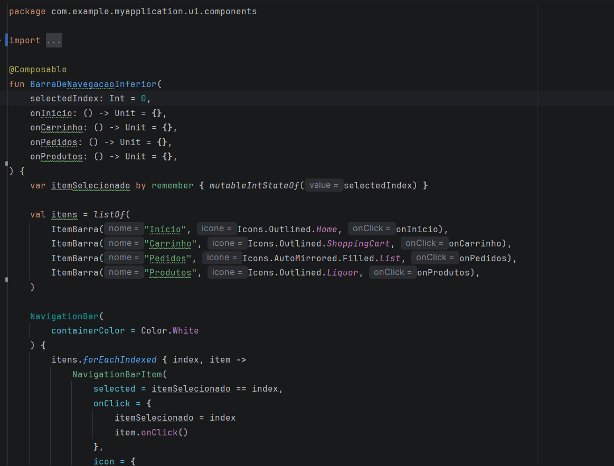

# Tela de Detalhes do Produto

A tela de detalhes deixou de mostrar um produto fixo e passou a exibir o produto que foi clicado, seja pela tela inicial, pela lista de produtos ou pela lista de produtos de uma categoria. Ela mostra imagem, estabelecimento, nome, volume e descrição, e tem um botão de favoritar. O diferencial dessa tela é que ao aumentar a quantidade de produtos o preço muda junto.

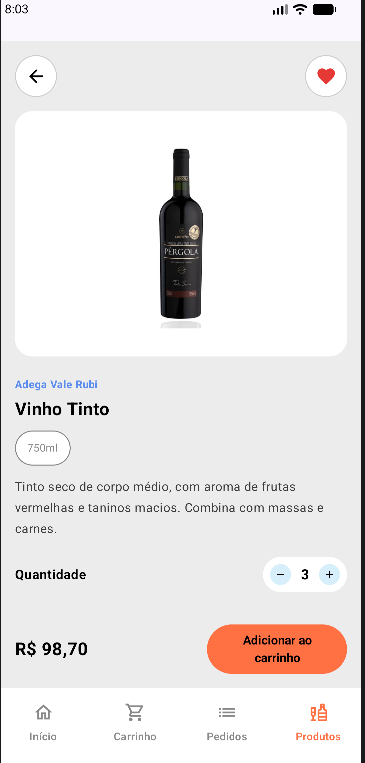

# Tela de Produtos por Categoria

Ao tocar numa categoria (no carrossel da tela inicial ou na lista de categorias), os produtos que pertencem a aquela categoria aparecem organizado em uma LazyColumn. O título da tela é o nome da categoria, e há uma mensagem própria quando a categoria ainda não tem produtos.

Escolhemos essa complexidade porque ela conecta as duas listas de modo que o usuário já sabe o que quer, então um toque na categoria já mostra as opções.

O diferencial desta tela é listar os produtos por categoria especifica, como Cerveja, Vinho, Destilado, etc, assim, fazendo a filtragem dos produtos mostrados

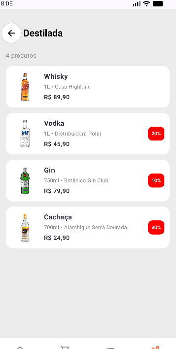

# Tela do Carrinho

O carrinho é guardado no ViewModel como uma lista de ItemCarrinho. Guardamos só o id, e não uma cópia do produto, para que o carrinho sempre mostre o dado atualizado (se o preço do produto for editado, o carrinho reflete isso).

Na tela, cada linha mostra imagem, nome, volume, preço e um seletor de quantidade. Quando a quantidade chega a zero, o item é removido do carrinho. Embaixo há um resumo com subtotal, taxa de entrega e total, calculados pelo ViewModel, e o botão "Ir para pagamento". Quando o carrinho está vazio, a tela mostra uma mensagem e o botão "Continuar comprando", que leva de volta ao início.

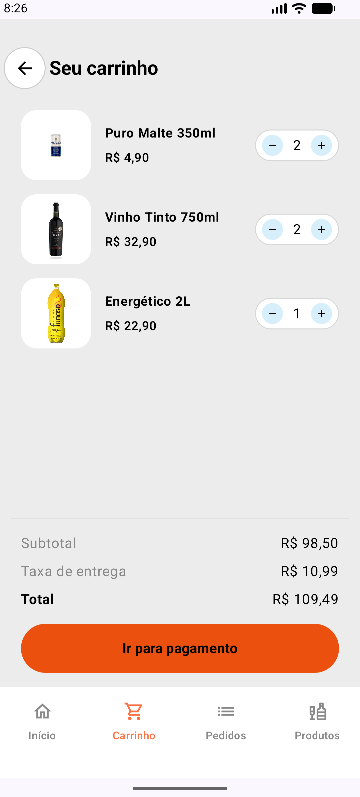

# Tela de Pagamento

A tela de pagamento lê os mesmos dados do carrinho no ViewModel: quantidade de itens, subtotal, entrega e total. Assim, o valor que o usuário vê aqui é sempre o mesmo do carrinho. Ela oferece três formas de pagamento (Pix, cartão de crédito e dinheiro na entrega) e o botão "Confirmar Pedido", que navega para a tela de rastreio.

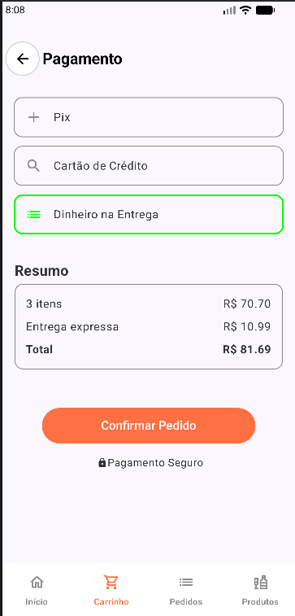

# Tela de Rastreio (Entrega)

Nesta versão, o conteúdo dessa tela é fixo devido a falta de tempo, não conseguimos deixar essa tela dinâmica por enquanto mas vamos fazer isso no futuro.

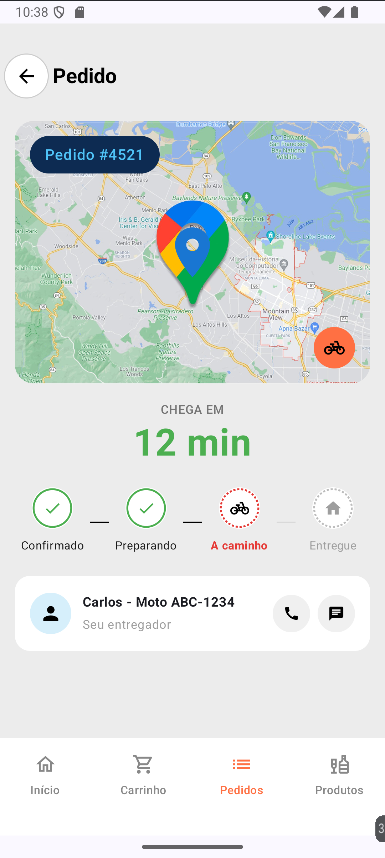

# Dificuldades

A nossa maior dificuldade foi fazer funcionar as telas dos formulários das listas, em um primeiro momento a lógica estava junto da tela e isso causou uma certa confusão, porém depois decidimos deixar tudo na própria viewModel, o que é uma escolha que não sabemos se é a mais correta ou se deveriamos criar multiplas viewModels para cada tela. No fim, não conseguimos validar por completo os formulários e ainda devem existir bugs desconhecidos para nós, que vamos trabalhar para corrigir até a próxima etapa desse trabalho.

